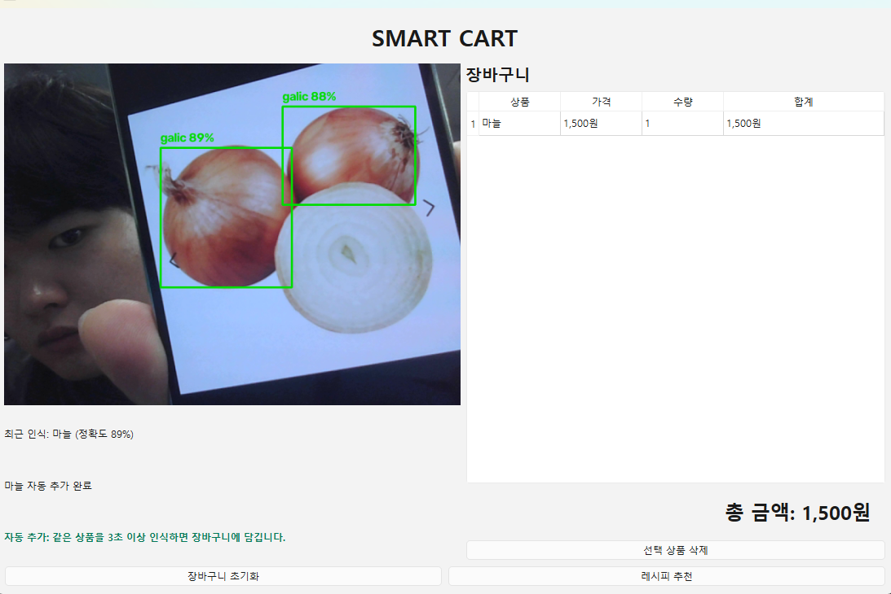
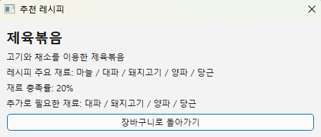
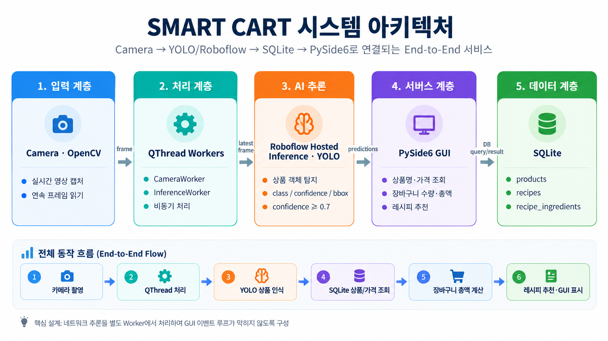
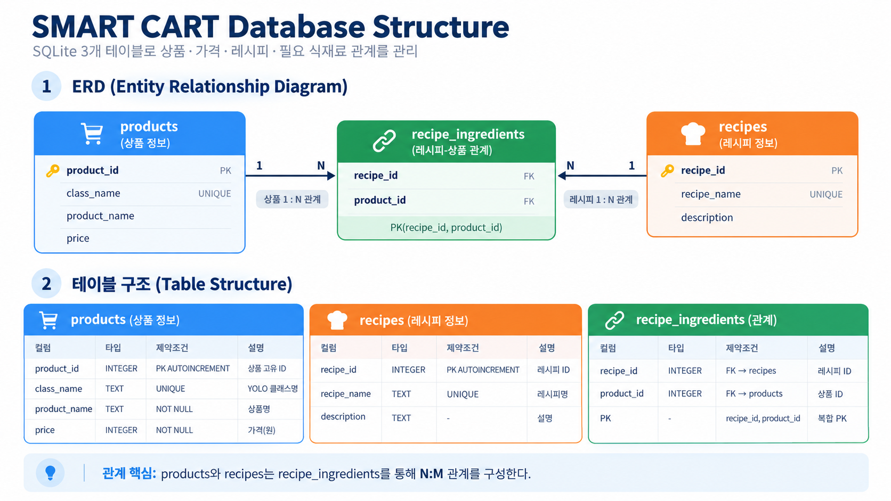
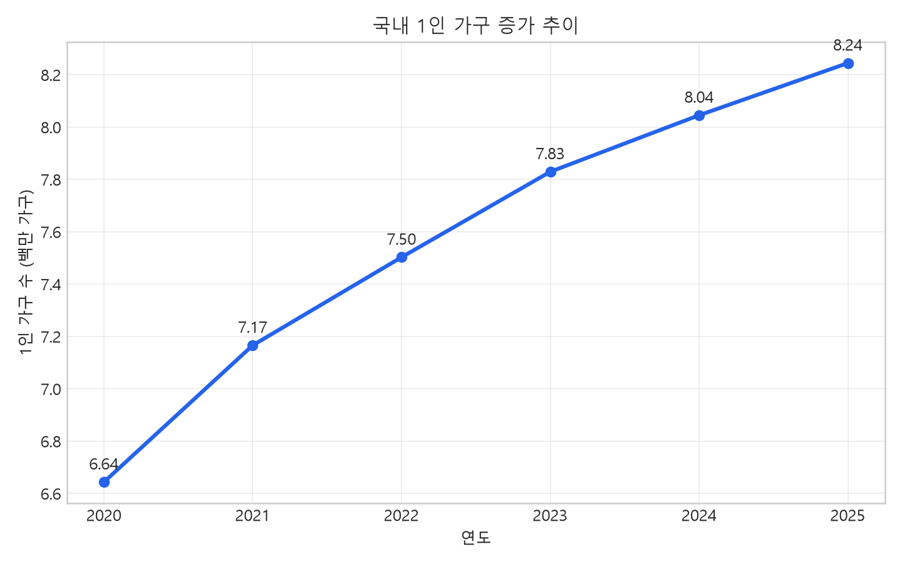
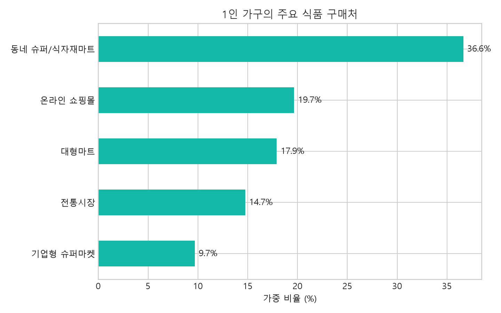
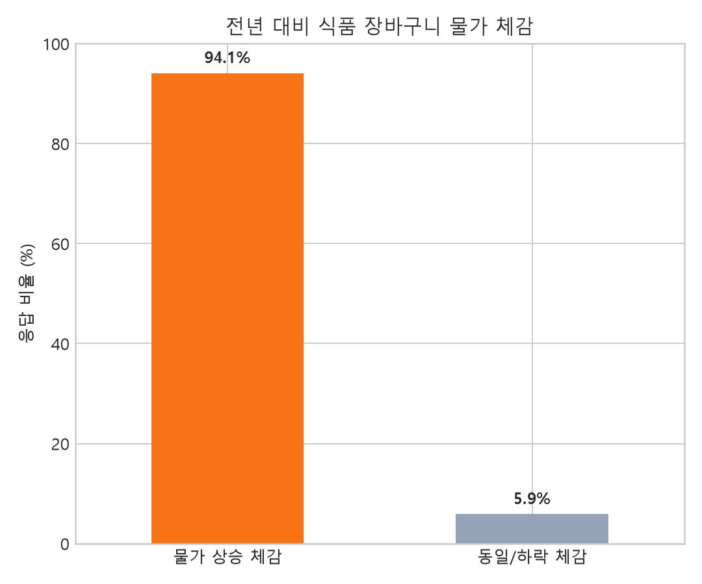
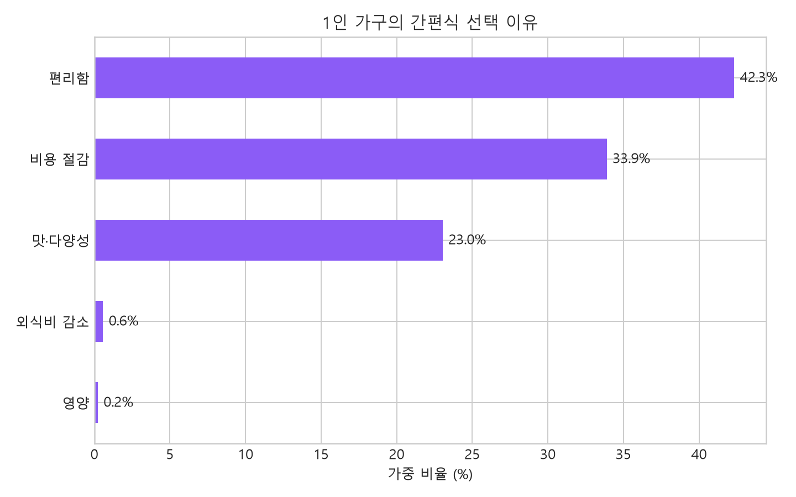
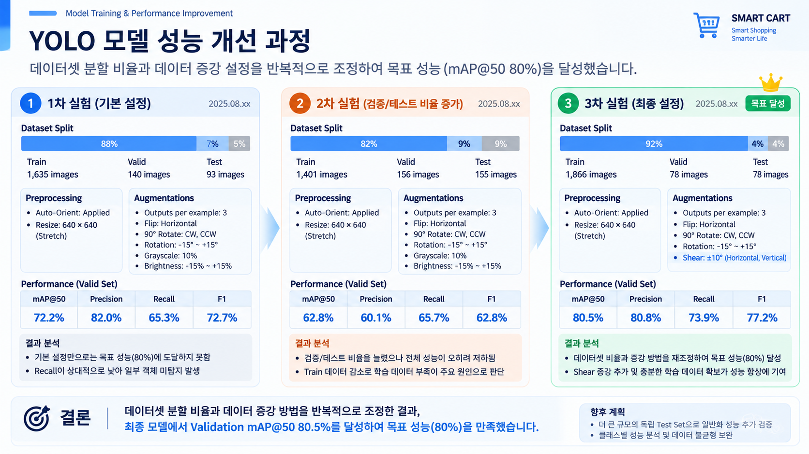

# SMART CART

카메라로 식재료를 인식해 장바구니에 담고, 합계 금액과 보유 재료 기반 레시피를 보여 주는 1인 가구용 스마트 카트 데모입니다. Roboflow Hosted Inference, SQLite, PySide6 GUI를 연결했습니다.

## 실행 화면

식재료를 인식하면 장바구니에 자동으로 담기고, 가격과 총액을 즉시 계산합니다.



보유 재료 충족률이 기준을 만족하는 레시피는 필요한 추가 재료와 함께 표시합니다.



## 주요 기능

- 카메라 영상에서 신뢰도 70% 이상의 식재료를 인식
- 같은 상품이 2초 이상 연속 인식되면 장바구니에 자동 추가
- SQLite 상품 DB를 바탕으로 가격·수량·총액 계산
- 보유 재료 충족률이 **50% 이상인 레시피만** 추천
- `green_onion`, `green onion`, `green-onion`, `대파` 등 대파 클래스명을 `l_onion`으로 통일해 DB와 연동

## 프로젝트 구조

```text
smart_cart/
  main.py                 # PySide6 GUI와 장바구니 흐름
  roboflow_detector.py    # 카메라 및 Roboflow 추론
  database.py             # 상품·레시피 SQLite DB
analysis.py               # 1인 가구 식품 소비행태 분석
evaluate_pr_curve.py      # Roboflow 모델 PR Curve 평가
```

## 시스템 설계

카메라 프레임은 별도 QThread에서 Roboflow 추론으로 전달해 GUI가 멈추지 않도록 구성했습니다. 인식 결과는 SQLite의 상품·레시피 정보와 연결됩니다.



상품과 레시피는 `recipe_ingredients` 관계 테이블로 연결됩니다.



## 설치 및 설정

Python 3.12와 [uv](https://docs.astral.sh/uv/)가 필요합니다.

```powershell
uv sync
```

프로젝트 최상위에 `.env` 파일을 만들고 Roboflow API 키를 설정합니다. `.env`는 Git에 포함되지 않습니다.

```env
RF_API_KEY=발급받은_API_키
ROBOFLOW_MODEL_ID=프로젝트ID/버전
```

`ROBOFLOW_MODEL_ID` 행을 생략하면 코드에 설정된 기본 모델 ID를 사용합니다.

## 실행

```powershell
uv run python -m smart_cart.main
```

API 키가 없으면 GUI와 카메라는 실행되지만 Roboflow 식재료 인식은 수행하지 않습니다.

## 레시피 추천 기준

장바구니에 담긴 식재료 수를 레시피의 필요 재료 수로 나눈 충족률을 계산합니다. 충족률이 50% 미만인 레시피는 추천 목록에서 제외하며, 나머지는 충족률과 보유 재료 수가 높은 순으로 표시합니다.

## 분석 및 모델 평가

원본 자료를 `datas/`에 준비한 뒤 아래 명령으로 1인 가구 식품 소비행태 그래프를 생성할 수 있습니다.

```powershell
uv run python analysis.py
```

Roboflow 테스트 세트 기준 PR Curve 평가는 다음과 같이 실행합니다.

```powershell
uv run python evaluate_pr_curve.py
```

생성되는 분석 그래프와 평가 결과는 `outputs/`에 저장되며 Git에서 제외됩니다.

### 1인 가구 식품 소비행태









### YOLO 모델 성능 개선

데이터셋 분할과 증강 설정을 조정해 최종 검증 세트에서 mAP@50 80.5%를 달성했습니다.


